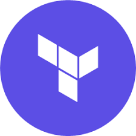

# Hello , i'm Leo 👋

- 📄 **Name**: Leonardo Pinho
- **🏠 From**: Brasília, Brazil.
- **🎓 Degree**: 
  - MBA | FullCycle Architeture ( Software Arch | Devops & SRE | Solution Arch )
  - Technologist | Software Analysis and Development
- I'm a Full-stack Developer with a specialized focus on back-end development.
- One Piece & Spy Family lover.
- Deep interest in Software Architecture, System Design and DevOps practices.
- Also entertained by personal SaaS & UX side projects
## My Tech Stack

**Back-End**

 

**DevOps**

**Front-End**

[//]: # (![alt text]&#40;./assets/icons/nextjs/nextjs-original-wordmark.svg "Logo Title Text 1"&#41;)

**Utilities**

**Pretty interessed (soon)**

 

 
 

